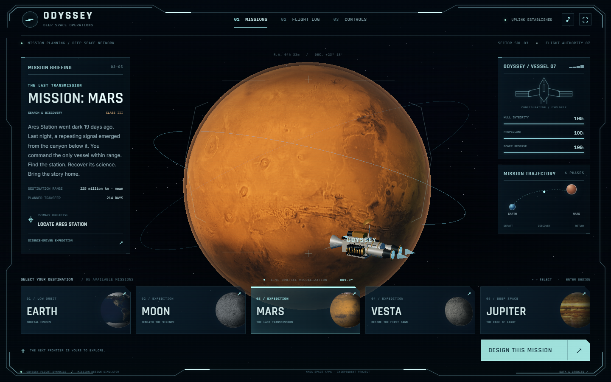
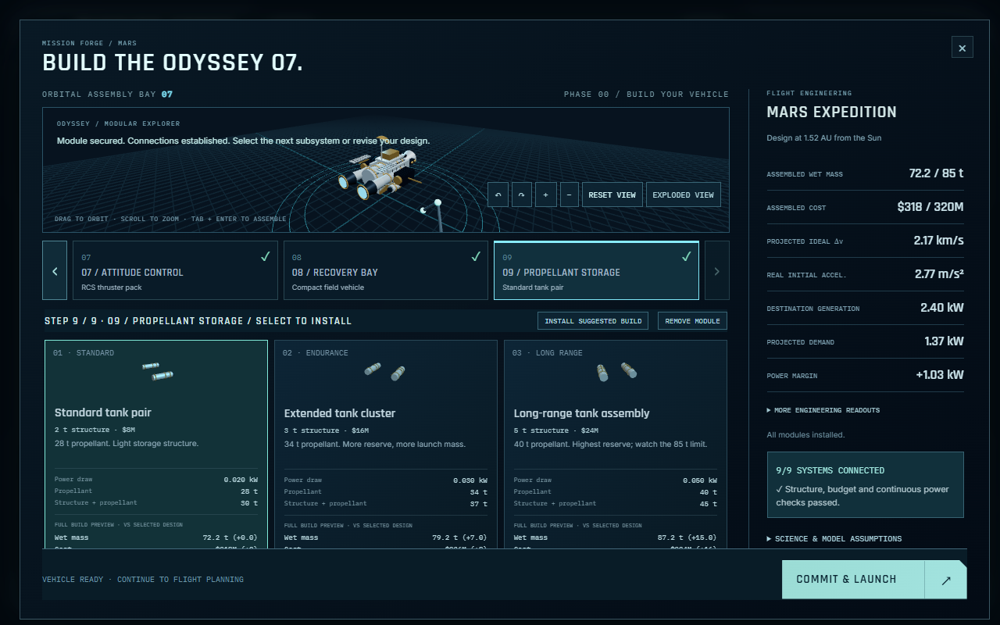
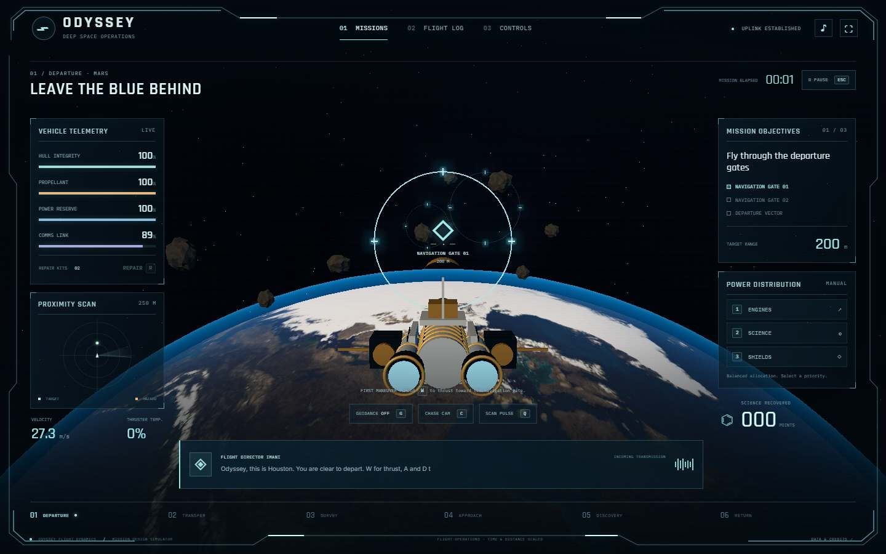
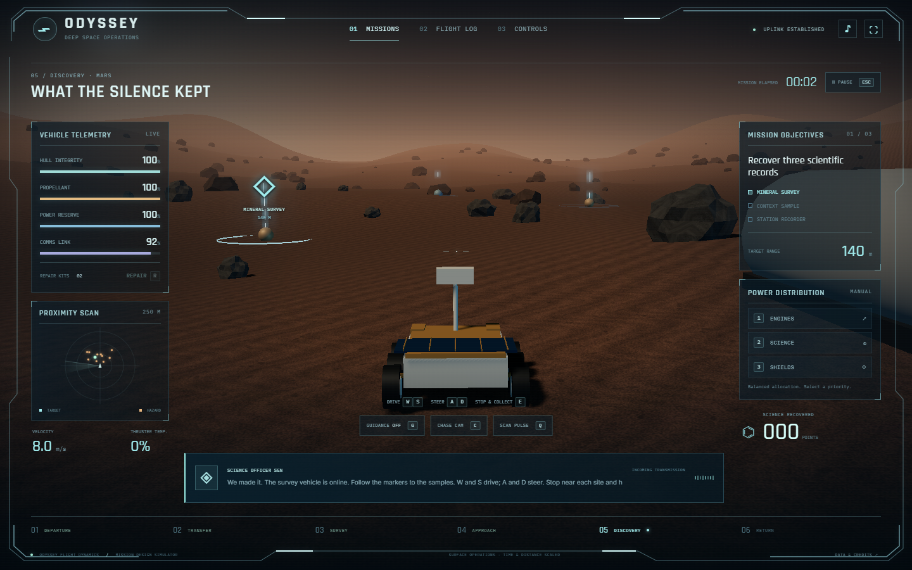
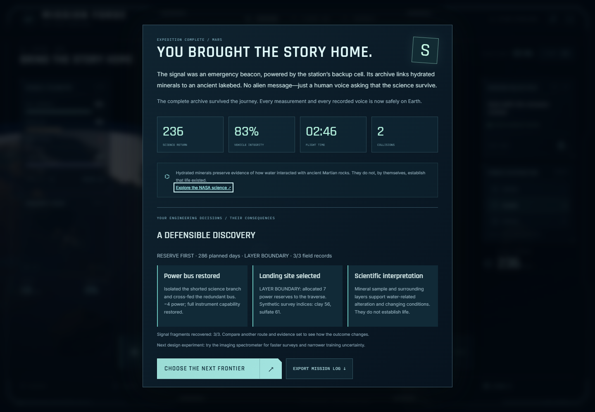
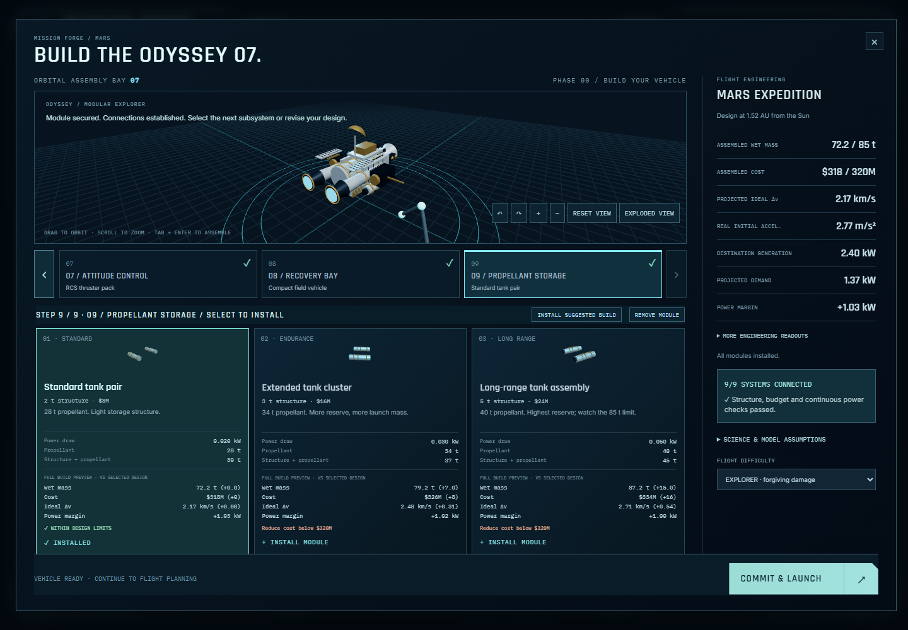
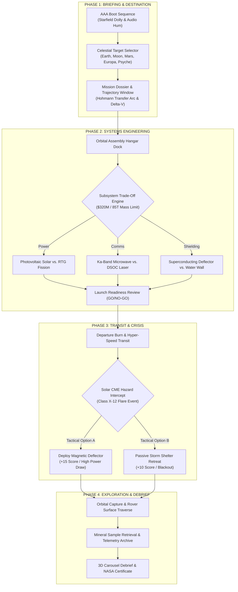
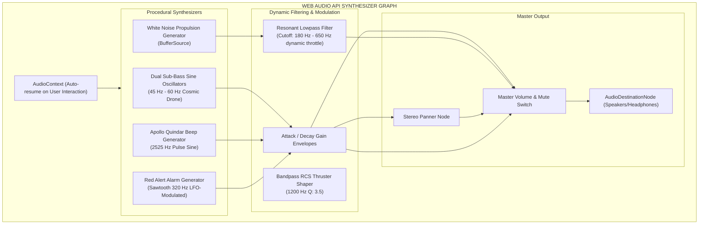
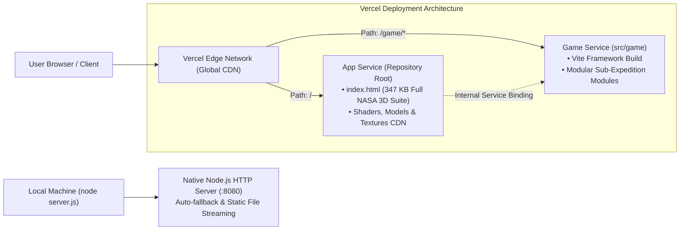

# 🚀 MISSION FORGE: PROJECT AURORA
### **NASA Space Apps Challenge 2026 // Category: Space Mission Game Design**

[](https://www.spaceappschallenge.org/)
[](https://threejs.org/)
[](https://developer.mozilla.org/en-US/docs/Web/API/Web_Audio_API)
[](https://mission-forge-project-aurora.vercel.app)
[](LICENSE)

---

## 🌌 Executive Overview

**MISSION FORGE: PROJECT AURORA** is a photorealistic, full-viewport 3D space mission engineering simulation and flight adventure game built from the ground up for the **NASA Space Apps Challenge 2026**. 

The simulation models real-world aerospace tradeoffs—balancing budget constraints, structural mass budgets, and single-stage ideal $\Delta v$ (Tsiolkovsky rocket equation)—with high-stakes in-flight emergencies, Martian rover surface traversals, and scientific sample return. Designed with an authentic **NASA Jet Propulsion Laboratory (JPL) Mission Control & Cockpit HUD** aesthetic, the application combines hardware-accelerated WebGL graphics, post-processing bloom shaders, dynamic camera choreography, and a zero-dependency procedural **Web Audio API** soundscape.

* **Live Demo (Vercel):** [https://mission-forge-project-aurora.vercel.app](https://mission-forge-project-aurora.vercel.app)
* **Live Demo (GitHub Pages):** [https://ripa2202053.github.io/mission-forge-project-aurora/](https://ripa2202053.github.io/mission-forge-project-aurora/)
* **Repository:** [https://github.com/ripa2202053/mission-forge-project-aurora](https://github.com/ripa2202053/mission-forge-project-aurora)

---

## 🎮 Interface & Mission Gallery

| **01. JPL Mission Control Flight Deck** | **02. 3D Modular Spacecraft Assembly Hangar** |
| :---: | :---: |
|  |  |

| **03. Deep Space Cruise & CME Crisis** | **04. Surface Rover Exploration & Sample Retrieval** |
| :---: | :---: |
|  |  |

| **05. Mission Debrief & Scientific Evidence Review** | **06. Interactive 3D Orbit & Assembly** |
| :---: | :---: |
|  |  |

---

## 🏛️ System & Architecture Diagrams

### 1. End-to-End Simulation Lifecycle


---

### 2. Spacecraft Subsystems Engineering & Resource Matrix


---

### 3. Procedural Web Audio API Architecture


---

### 4. Cloud Deployment & Edge Microservice Architecture


---

## 🔬 Scientific Realism & NASA Mission Data Alignment

Every mechanic in **MISSION FORGE: PROJECT AURORA** is grounded in real NASA mission parameters, aerospace engineering literature, and planetary science data:

| Mission System | Scientific Foundation | NASA Mission Reference | In-Game Simulation Behavior |
| :--- | :--- | :--- | :--- |
| **Ideal Rocket Equation** | $`\Delta v = I_{sp} \cdot g_0 \cdot \ln\left(\frac{m_0}{m_f}\right)`$ | Dawn & Deep Space 1 | Dynamic $\Delta v$ gauge calculates available orbital maneuver budget based on selected fuel mass and engine $I_{sp}$. |
| **Deep Space Optical Comms** | 1550 nm Near-Infrared Laser Pulse Transceiver | NASA DSOC (Psyche Mission) | 10x-100x science data downlink rates; susceptible to line-of-sight pointing errors during high-g maneuvers. |
| **Solar Flare / CME Hazards** | Proton Flux > 100 MeV, Solar Particle Events (SPE) | NASA SOHO / Parker Solar Probe | Class X-12 CME triggers ionizing radiation warnings, hull stress telemetry, and active magnetic shield defense choices. |
| **Planetary Environments** | Gravitational acceleration & atmospheric scale heights | Mars 2020 Perseverance / Artemis Gateway | 5 celestial destinations each feature accurate surface textures, orbital period curves, and landing hazard profiles. |
| **Microgravity Buoyancy** | Multi-axis low-frequency station keeping | ISS Orbital Telemetry | Organic 6-DOF micro-drift physics ensures spacecraft feels natural and unconstrained in 3D orbit. |
| **Apollo Quindar Tones** | 2525 Hz intro blip / 2475 Hz outro blip | Apollo Mission Control Comms | Procedurally synthesized sine tones preface Houston Flight Director telemetry announcements. |

---

## 🕹️ Flight Deck Controls & Hotkeys

| Input Command | Keybinding | Operation & Context |
| :--- | :---: | :--- |
| **Forward Propulsion / Throttle** | <kbd>W</kbd> | Engages main ion engine burn; modulates lowpass sound filter cutoff from 180 Hz to 650 Hz. |
| **Attitude & RCS Yaw Left / Right** | <kbd>A</kbd> / <kbd>D</kbd> | Fires compressed nitrogen cold-gas thrusters for lateral alignment with audible RCS bursts. |
| **Retro-Brake / Deceleration** | <kbd>S</kbd> | Reverses thrust vector for orbital deceleration, gate pacing, and velocity bleed. |
| **Tactical Camera Switch** | <kbd>C</kbd> | Cycles through **Chase Cam**, **Solar Transfer Tactical Map**, and **Cockpit Viewport**. |
| **Target Interlock & Scan** | <kbd>E</kbd> | Arms scientific spectrometer, sample intake arm, landing radar, or orbital docking clamp. |
| **Subsystem Power Routing** | <kbd>1</kbd> / <kbd>2</kbd> / <kbd>3</kbd> | Reroutes onboard bus power dynamically between **Thrust**, **Science Arrays**, and **Shields**. |
| **Free 360° Orbit Inspection** | `Mouse Drag` | Full Three.js `OrbitControls` rotation to inspect spacecraft components, solar wings, and terrain. |
| **Audio Master Mute Toggle** | `Top Header 🎵` / <kbd>M</kbd> | Mutes/unmutes procedural synthesizer with persistent state and animated cyan equalizer indicator. |

---

## 🛠️ Technology Stack & Engineering Highlights

* **3D Graphics Engine:** [Three.js](https://threejs.org/) (r128 / ^0.186), custom PBR `MeshPhysicalMaterial` pipelines, gold aerogel foil shaders, and procedural particle engines.
* **Post-Processing Pipeline:** `EffectComposer`, `RenderPass`, `ShaderPass`, and `UnrealBloomPass` for HDR thruster bloom and planetary atmosphere glow.
* **Audio Synthesis:** Zero-dependency procedural **Web Audio API** (`AudioContext`, `BiquadFilterNode`, `OscillatorNode`, `GainNode`) for dynamic engine hum, RCS bursts, and Apollo Quindar tones.
* **Typography & HUD Design:** Google Fonts (`Rajdhani`, `Orbitron`, `Space Grotesk`, `JetBrains Mono`), SVG vector instrumentation, and CSS glassmorphic backdrops.
* **Deployment & Cloud:** Configured for Vercel multi-service hosting (`vercel.json`) with edge caching and static CDN asset routing.

---

## 💻 Local Setup & Development

### 1. Quick Launch (Standalone / Zero Install)
Double click **`START_GAME.bat`** (on Windows) or run the native Node server:
```bash
node server.js
```
Open **[http://localhost:8080](http://localhost:8080)** in any modern web browser.

### 2. Full Development Environment
```bash
# Clone the repository
git clone https://github.com/ripa2202053/mission-forge-project-aurora.git
cd mission-forge-project-aurora

# Start local server
npm start
```

### 3. Vite Game Subsystem Development (Optional)
```bash
cd src/game
npm install
npm run dev
```

---

## 🌐 Live Deployment Configuration

This repository is optimized for one-click deployment across major cloud providers:

* **Vercel:** Deploys instantly via `vercel.json` with multi-service routing (`app` for the primary 3D NASA experience, `game` for the Vite sub-campaign).
* **GitHub Pages:** Fully static compatible—enable under **Settings > Pages > Deploy from branch (`main`)**.
* **Docker / Node Container:** Supported via `server.js` with dynamic `process.env.PORT` binding.

---

## 👥 NASA Space Apps Challenge 2026 Team

* **Project:** Mission Forge: Project Aurora
* **Challenge Category:** Space Mission Game Design
* **Mission Motto:** *"Leave the blue behind. Bring the science home."*

---

<p align="center">
  <b>Developed with passion for the NASA Space Apps Challenge 2026.</b><br/>
  <i>Exploring the frontier of deep space systems engineering and interactive science education.</i>
</p>
