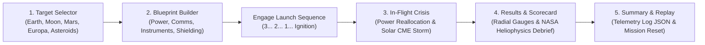

# MISSION FORGE: PROJECT AURORA — An Interactive Space Mission Design Game
**NASA Space Apps Challenge 2026 // Category: Space Mission Game Design**

---

## 🚀 Mission Overview
**MISSION FORGE: PROJECT AURORA** is a full-viewport, responsive, single-page interactive playable space mission engineering simulation game. It models the complex multi-variable systems engineering, architectural trade-offs, and in-flight crisis decision-making required for deep-space interplanetary exploration.

Engineered with an authentic **NASA Cockpit Flight Deck & Mission Control Sci-Fi HUD**, this application features a seamless looping HTML5 background space video, a dark radial vignette overlay, subtle cockpit visor brackets at all screen edges, glowing glassmorphic panels, Google Fonts typography (`Rajdhani` and `Share Tech Mono`), live persistent telemetry gauges, and a pure Web Audio API synthesizer engine.

---

## 🛸 Game Loop Architecture (5 Phases)



### Phase 1: Dramatic AAA Game Title Sequence ("MISSION FORGE")
- **First-Load Deep Space Boot Sequence (2 Seconds)**:
  - Deep space void boot screen with ambient cosmic audio synthesizer hum.
  - Green/cyan terminal text typewriter animation: `// DEEP SPACE NETWORK: ONLINE // CONNECTING TO ARES V ORBITAL VIEWPORT...`
  - Automated high-speed camera dolly forward through 5,000 stars, revealing the majestic glowing Mars sphere.
- **Cinematic Title & Hero Composition**:
  - Centered Grand Title in glowing white/cyan: **`MISSION FORGE`** (`clamp(3.6rem, 7.8vw, 6.2rem)`).
  - Sub-header: **`[ PROJECT AURORA // NASA MISSION DESIGN SIMULATOR ]`** with glowing cyan pulse beacon.
  - Iconic Challenge in sleek tracking typography: **`EARTH NEEDS YOU. CAN YOU DESIGN A MISSION THAT MAKES IT HOME?`**
- **Floating Glassmorphic Flight Briefing Badge**:
  - Translucent pill badge: **`[ TARGET: MARS ] • [ CREW: 4 ] • [ DURATION: 18 MONTHS ] • [ BUDGET: $210M ]`** with backdrop blur and cyan neon borders.
  - Center animated 10-second circular glowing cyan SVG countdown ring with live audio tick and critical alert countdown.
- **High-Visibility Launch CTA Button**:
  - Wide glowing cyan button: **`[ ENTER MISSION CONTROL // START DESIGN ]`**.
  - Interactive Bracket Lock: on hover, coordinate brackets `[ ]` smoothly lock into position with intense cyan neon glow and audio hover tick.
  - On click: triggers a dramatic camera zoom into Mars with warp-drive speed lines, transitioning to the Celestial Target Selector.

### Phase 2: Celestial Target Selector ("Design Your Own Mission")
- **Seamless Camera Dolly / Zoom Transition**:
  - Clicking `[ INITIATE MARS MISSION DESIGN ]` from Screen 1 triggers a smooth TWEEN camera dolly into the Screen 2 interplanetary trajectory stage.
  - Includes a `[ ⮜ RETURN TO MISSION BRIEFING ]` button to fly back to Screen 1 at any time.
- **Persistent Top Flight Deck HUD**:
  - Live persistent gauges: `PWR: 68%`, `FUEL: 54%`, `COMMS: 82%`, `BUDGET: $210M`, plus Web Audio API toggle.
- **Horizontal Planet Selector Deck (5 Destinations)**:
  - 5 glassmorphic destination cards along the bottom deck:
    1. **Earth Observation** (Low Earth Orbit // Climate Science)
    2. **Moon Outpost** (Artemis Gateway // Lunar Polar Outpost)
    3. **Mars Expedition** (Aurora Expedition // Deep Astrobiology - DEFAULT ACTIVE)
    4. **Europa Ocean** (Jovian System // Subsurface Ocean Probe)
    5. **Asteroid Belt** (16 Psyche Survey // Metal Prospecting)
  - Features real high-resolution spherical textured planet preview icons with soft outer rim lighting and 3D specular shadows.
  - Clicking any card dynamically updates the 3D celestial sphere in the WebGL scene (swapping textures, atmospheric glow colors, planetary radii, and orbital rings), plays an audio click chime, and updates the telemetry dossier in real time.
- **Interactive Target Dossier Panel (Mars / Project Aurora)**:
  - Transparent glassmorphic dossier panel with `backdrop-filter: blur(16px)` and cyan borders:
    - **Mission Codename**: `AURORA PRIME // MARS HABITABILITY MISSION`
    - **Primary Objective**: *"Search for signs of past microbial life and map subsurface water ice reserves."*
    - **Telemetry Specs Grid**:
      - `DIFFICULTY: [ADVANCED]`
      - `FLIGHT TIME: [18 MONTHS ROUND-TRIP]`
      - `CREW COMPLEMENT: [4 ASTRONAUTS]`
      - `TRAJECTORY WINDOW: [HOHMANN TRANSFER ORBIT]`
      - `PRIMARY SURFACE TARGET: [JEZERO CRATER DELTA]`
- **Action CTA & Warp Transition to Screen 3**:
  - Primary button: **`[ MISSION SELECTED: ASSEMBLE SPACECRAFT ] ➔`**
  - Triggers a synthesized warp hum and a 3D camera fly-by speed-lines effect into the Spacecraft Configurator & Assembly Hangar (Screen 3).

### Phase 3: Spacecraft Configurator & 3D Orbital Hangar Dock ("Screen 3")
- **100% Realistic 3D Interplanetary Explorer Vessel (Zero Wireframe Nets or Cages)**:
  - Wireframe sphere meshes completely removed: vessel floats completely clean and unobstructed in deep space.
  - Inside the center WebGL Three.js canvas, renders an authentic 3D modular explorer vessel:
    - **Crew Habitat Module**: Cylindrical matte titanium fuselage (`roughness: 0.35, metalness: 0.85`), dark thermal aerogel nosecone, pressurized gold foil airlock collar, and tinted cockpit canopy with specular reflections.
    - **Deployable Solar Array Wings**: Articulated truss arms with large photovoltaic panels featuring deep-blue/cyan solar cells and gold busbars.
    - **Deep-Space Comms Suite**: Steerable Ka-Band parabolic microwave dish with sub-reflector feed horn (swappable to next-gen DSOC Optical Laser Transceiver dome).
    - **Dual Ion Propulsion Thrusters**: Machined titanium engine bell nozzles with inner white-hot core cones (`0xFFFFFF`), outer glowing cyan plasma engine plumes, and an animated 90-particle ion exhaust stream flickering dynamically in the animation loop.
    - **Radiation Deflector Core**: Superconducting toroid ring (`detailedShieldRing`) with dynamic emissive cyan glow pulsing organically.
  - **Authentic Microgravity Drift Animation**: Multi-frequency organic floating physics (pitch, yaw, roll, and vertical hover oscillation) making the spacecraft feel alive in space.
  - **Full 360° OrbitControls**: Click and drag anywhere to inspect the 3D vessel from any angle (front, top, underside, engine nozzles).
- **Compact 3-Tab Subsystem Configurator (Zero Viewport Overflow)**:
  - Eliminates vertical browser scrollbars completely with a sleek, 100vh gaming cockpit drawer (`background: rgba(4, 12, 24, 0.4)`, `backdrop-filter: blur(16px)`).
  - Divided into 3 horizontal category tabs: **`[ POWER ]`** | **`[ COMMS ]`** | **`[ SHIELDING ]`**.
  - Selecting a tab reveals only the 2 pertinent hardware choices, keeping vertical footprint compact and clean.
  - Subsystem cards feature reduced padding, neon-accented hover effects, and bright cyan active status indicator dots.
- **Interactive 3D Subsystem Callouts**:
  - 3 dynamic holographic leader badges tracked in 3D screen space (`project(camera)`) and connected by ultra-sharp SVG leader lines (`1.2px` stroke, dashed).
  - Pointers are clickable: clicking **`[ SUBSYS 01: POWER BUS ]`**, **`[ SUBSYS 02: HIGH-GAIN COMMS ]`**, or **`[ SUBSYS 03: DEFLECTOR SHIELD ]`** automatically jumps to that category tab in the right drawer with visual feedback.
- **Dynamic 3D Hardware Swapping & Floating Trade-Off Tags**:
  - Equipping options swaps 3D geometry in real-time (Solar Wings <-> RTG fins, Ka-Band Dish <-> DSOC Laser, Magnetic Ring <-> Water Wall).
  - Spawns animated floating count-up tags over the ship:
    `+55 kW SOLAR POWER`, `+18% SCIENCE // DSOC LASER`, `+650 KG // CONTINUOUS RTG`.
- **Permanently Pinned Bottom Launch CTA**:
  - Pinned footer at the bottom of the drawer displays real-time telemetry summary badges:
    `TOTAL MASS: 14,200 KG` | `POWER NET: +17.0 kW` | `BUDGET: $210M / $250M`.
  - Prominent glowing neon cyan button: **`[ CONFIRM CONFIGURATION & COMMENCE TRANSIT ➔ ]`**.
- **100% Borderless Edge-to-Edge Viewport**:
  - All HUD corner bracket elements, reticles, scanline overlays, and visor lines completely eliminated.
  - Viewport is seamless, borderless, and edge-to-edge.

### Phase 4: Interactive Multi-Stage NASA Flight Transit Simulation ("Screen 4")
- **Stage 1 & 2: Hyper-Speed Launch & 4-Second Dynamic Cruise**:
  - Clicking `[ CONFIRM CONFIGURATION & COMMENCE TRANSIT ]` initiates the deep-space synthesizer music loop (`space_ambience_loop.ogg`) at volume 0.35 looping.
  - Camera dynamically swoops behind the dual ion thrusters.
  - Dual ion engine plumes burst into hyperdrive thrust with star-streak warp lines stretching past the camera.
  - Real-time telemetry readouts update dynamically:
    - `WARP ACCELERATION`: Ramping smoothly from `11.2 KM/S` -> `32.4 KM/S`.
    - `TRANSIT STAGE`: `DEEP SPACE CRUISE`.
    - `DISTANCE TO MARS`: Real-time countdown from `54,600,000 KM` decreasing dynamically each frame.
  - **3-Way Interactive Camera Controls**:
    - **`[ 🛰️ CHASE CAM ]`**: 3rd-person camera dynamically locked behind the ship.
    - **`[ 🌌 TACTICAL SOLAR MAP ]`**: Overhead high-angle view of the inner solar system and full transfer arc.
    - **`[ 🚀 COCKPIT VIEWPORT ]`**: Forward-facing cockpit vantage point looking ahead toward deep space.
- **Stage 3: Sudden Solar Storm Crisis Intercept (After 4s Cruise)**:
  - Exactly after 4 seconds of cruising, transition directly into the Space Weather / Solar Flare Crisis encounter.
  - Red alert klaxon alarm and flashing warning overlays:
    `⚠️ CLASS X-12 CORONAL MASS EJECTION DETECTED // 850 mSv/hr FLUX`.
  - Realistic 3D solar particle storm (1,800 energetic particles) rushes violently from the Sun across the flight path.
  - 15-second circular SVG countdown timer ring prompts a critical tactical choice:
    - **Option A: `[ ⚡ DEPLOY SUPERCONDUCTING DEFLECTOR SHIELD ]`**: Magnetic toroid ring flares to 300% emissive intensity and pulses, deflecting the CME flux (+15 Score bonus, 100% crew protection).
    - **Option B: `[ 🛡️ STORM SHELTER & WATER WALL BUFFER ]`**: Crew retreats into passive water-shielded habitat (+10 Score bonus, temporary telemetry blackout).
- **Stage 4: Mars Insertion & Victory Debrief**:
  - Ship arrives at Mars, rotates 180° into retrograde burn attitude, and fires ion thrusters to brake into a stable 320 km Martian polar orbit (`Δv: 1.4 km/s`).
  - Triumphant NASA fanfare audio triggers.
  - **Comprehensive Victory Debrief Screen**:
    - **Flight Scorecard**: Dynamic score out of 100 (e.g. `96/100`) and Grade A+ rating.
    - **Telemetry Breakdown**: Total Transit Duration (214 Days / 7.1 Mos), Distance (225.48M KM), Crew Survival (100%), Fuel Reserves (62.8%).
    - **Official NASA Flight Architect Certificate**: Official credential box with NASA blue insignia, authorized signatures, and Certificate ID: `NASA-AURORA-ARES5-2026`.
    - **Replay & Education**:
      - **`[ 🔄 DESIGN ANOTHER MISSION ]`**: Smoothly resets state and returns to Celestial Destination Selector.
      - **`[ 📜 VIEW NASA HELIOPHYSICS SCIENTIFIC LOGS ]`**: Educational modal with real NASA data on CMEs, SPEs, Mars 2020 RAD radiation levels, and DSOC optical laser communications.

## 🎛️ Design System & Technical Specifications
- **Full WebGL 3D Three.js Engine & Photorealistic PBR Pipeline**: Complete 3D viewport canvas powered by Three.js (r128 / ^0.186):
  - **Dynamic Celestial Axis Rotation & Day/Night Terminator**: Realistic continuous planetary spin (`rotation.y += 0.0015`) on tilted axes. Surface bump mapping (`bumpScale: 0.32`, `roughness: 0.88`) casts deep, dynamic moving relief shadows across craters and mountain ridges against harsh directional sunlight (`intensity: 3.8` at `(65, 25, 42)`).
  - **Authentic Zero-G Buoyancy Float**: Spacecraft micro-gravity buoyancy using smooth sine wave oscillations (`position.y += Math.sin(time * 0.8) * 0.003`, `rotation.z += Math.cos(time * 0.5) * 0.001`, `rotation.y += Math.sin(time * 0.3) * 0.0008`), keeping the vessel gracefully alive in the orbital hangar dock and planetary orbit.
  - **Photorealistic Metallic PBR Spacecraft**: Fuselage rendered with `MeshPhysicalMaterial` (`metalness: 0.9, roughness: 0.18, clearcoat: 0.8, clearcoatRoughness: 0.1, color: 0xC8D2DC`) for sharp specular gloss highlights along the hull, accented with gold thermal foil insulation wrap (`color: 0xFFA500`, clearcoat, emissive) and exposed copper conduits.
  - **High-Intensity Glowing Ion Propulsion**: Conical thruster bell nozzles emitting bright emissive cyan plumes (`MeshStandardMaterial` with `color: 0x00FFFF, emissive: 0x00FFFF, emissiveIntensity: 2.5`, additive blending) and an animated trailing particle exhaust stream streaming behind the vessel in real time.
  - **Pulsing Orbital Trajectory**: Dynamic orbital trajectory line with sinusoidal opacity pulsing (`opacity = 0.55 + Math.sin(time * 2.5) * 0.22`).
  - **Multi-Layered Cosmic Void & Space Dust**: 3 distinct parallax starfield layers (3,000 deep space stars, 2,000 mid-range constellations, 800 foreground stars) rotating at differentiated parallax rates, plus 500 drifting zero-G micron space dust particles floating past the camera for deep perspective depth.
  - **Cinematic Camera Choreography & Smooth Damping**: `OrbitControls` with smooth damping (`dampingFactor: 0.05`) and automated idle slow-pan auto-rotation (`autoRotate: true, autoRotateSpeed: 0.45`) creating an AAA game cinematic experience when not dragging.
  - **3D Solar CME Particle Storm**: 1,800 energetic red/orange/amber particle system rushing past the camera with cockpit emergency red alert strobe and deployable 3D magnetic shield bubble.
- **Post-Processing & Glow Engine**: Powered by `postprocessing` / `@react-three/postprocessing` with `EffectComposer`, `RenderPass`, and `BloomEffect` delivering realistic bloom glow on cyan/blue plasma engine thrusters, core flame cones, and planetary atmospheres.
- **Background Layer**: Dual-mode rendering with seamless full-screen HTML5 deep-space background video fallback and real-time WebGL canvas.
- **HUD & Cockpit Frame**: Transparent floating sci-fi layer (`pointer-events: none` container with `pointer-events: auto` interactive controls), cockpit visor overlay with glassmorphic panels (`background: rgba(6, 18, 36, 0.55); backdrop-filter: blur(14px); border: 1px solid rgba(0, 229, 255, 0.35); box-shadow: 0 8px 32px 0 rgba(0, 0, 0, 0.55), 0 0 18px rgba(0, 229, 255, 0.22)`).
- **Typography & Font Stack**:
  - `Orbitron`: Primary titles, grand headers, mission identifiers, and cyber buttons.
  - `Space Grotesk`: Secondary UI descriptions, mission briefs, and dialog text.
  - `JetBrains Mono` / `Share Tech Mono`: High-contrast live flight telemetry readouts, mission clock, gauges, and numerical data.
- **Persistent Top Telemetry Bar**: Persistent header flight deck featuring:
  - Vector NASA Meatball insignia with cyan orbital drop-shadow.
  - Title: `MISSION FORGE: PROJECT AURORA` with subtitle telemetry tag.
  - Live animated gauges: `POWER: 68%`, `FUEL: 54%`, `COMMS: 82%`, `BUDGET: $210M`.
  - Ambient audio toggle button with live status indicators.
- **Pure Procedural Web Audio API Synthesizer (Zero External Dependencies)**:
  - 100% self-contained synthesized audio engine with zero external audio file downloads:
  - Low-frequency ambient cosmic hum: Dual sine oscillator at 55Hz & 110Hz routed through a 160Hz lowpass filter with smooth master gain ramping.
  - Crisp tactile UI beeps and frequency-swept chirps (720Hz $\rightarrow$ 1440Hz) automatically triggered on all buttons, tabs, hardware option cards, and celestial targets.
  - Synthesized white-noise thruster burn acoustic burst with resonant bandpass filtering.
  - 1.5 Hz emergency Red Alert frequency-modulated alarm klaxon.
  - Affirmative action chimes and triumphant multi-tone victory fanfare.
- **Pure Gaming Viewport**: Full viewport height (`100vh`, `overflow: hidden`) locking the player into an authentic cockpit flight deck experience with full 3D interactive orbital drag controls.

---

## 💻 How to Run

The game is hosted and ready to play immediately:

1. **Active Local Server**:
   A native Node.js HTTP server is actively running:
   ```bash
   node server.js
   ```
2. **Access in Browser**:
   Open **[http://localhost:8080](http://localhost:8080)** in Chrome, Edge, Firefox, or Safari.
3. **Standalone Direct Launch**:
   You can also double-click `index.html` directly in your file explorer.

---

*"Maybe the next space mission designer is already playing."*  
**NASA Space Apps Challenge 2026**

